# مخططات النظام المصرفي الآمن

## 1. مقدمة

يحتوي هذا الملف على المخططات التي توضح معمارية النظام، وتدفق الطلبات، وآلية تسجيل الدخول، وتنفيذ التحويل المالي، والعلاقات بين مكونات المشروع.

تم إنشاء المخططات باستخدام لغة:

يمكن عرض مخططات Mermaid مباشرة على GitHub عند وضعها داخل كتل `mermaid`،
كما يمكن معاينتها داخل VS Code باستخدام إضافة تدعم Mermaid.

Markdown Preview Enhanced
---

## 2. المخطط العام للنظام

يوضح المخطط التالي المكونات الأساسية للنظام المصرفي الآمن:

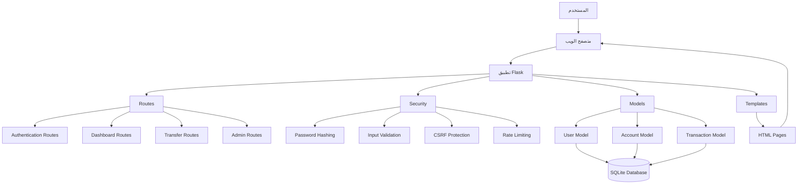

---

## 3. طبقات النظام

يعتمد النظام على عدة طبقات منفصلة:

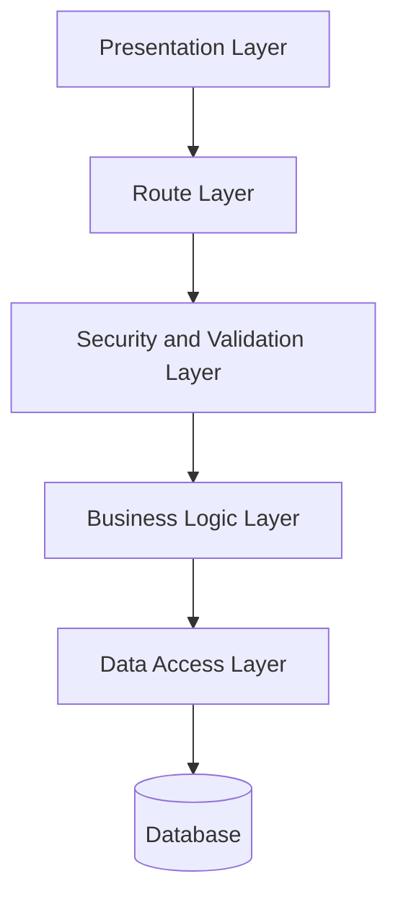

### طبقة العرض

تتكون من:

- صفحات HTML.
- ملفات CSS.
- Bootstrap.
- قوالب Jinja2.

### طبقة المسارات

تستقبل طلبات المستخدم وتوجهها إلى الوظائف المناسبة.

### طبقة الأمان والتحقق

تتحقق من:

- تسجيل الدخول.
- صلاحية المستخدم.
- صحة المدخلات.
- قوة كلمة المرور.
- رقم الحساب.
- مبلغ التحويل.

### طبقة منطق النظام

تنفذ:

- إنشاء المستخدم.
- إنشاء الحساب.
- تسجيل الدخول.
- تنفيذ التحويل.
- إدارة المستخدمين.

### طبقة البيانات

تتولى التعامل مع قاعدة البيانات من خلال SQLAlchemy.

---

## 4. تدفق الطلب داخل النظام

يوضح المخطط كيف ينتقل طلب المستخدم داخل التطبيق:

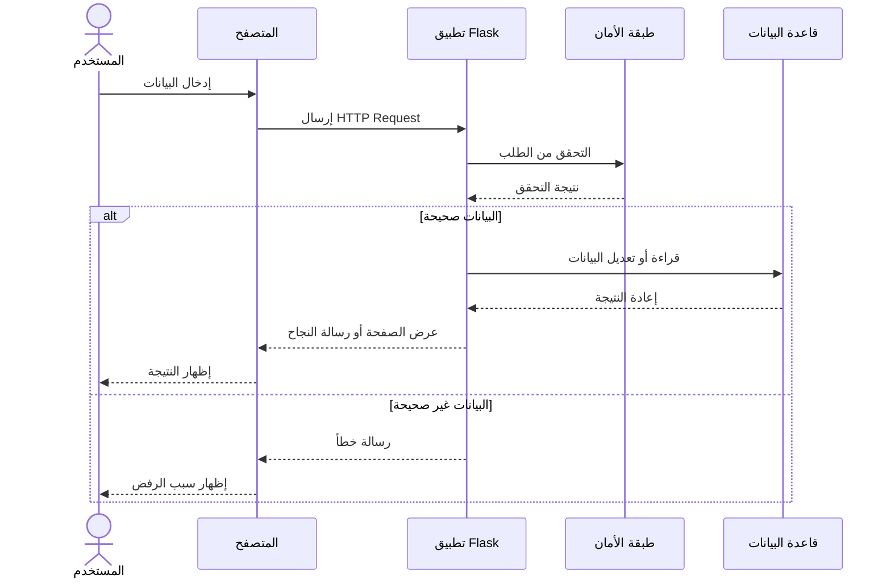

---

## 5. مخطط تسجيل مستخدم جديد

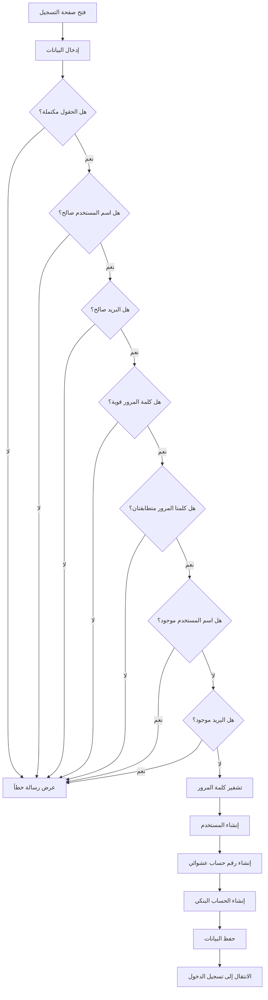

---

## 6. مخطط تسجيل الدخول

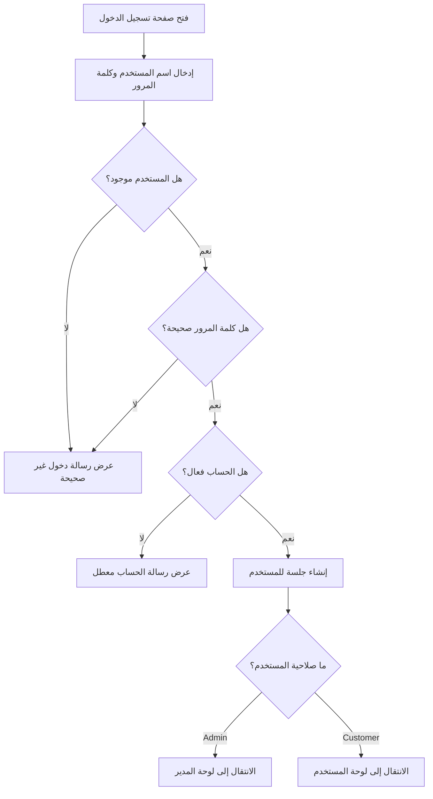

---

## 7. مخطط تنفيذ التحويل المالي

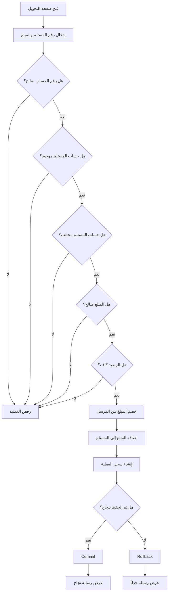

---

## 8. التسلسل التفصيلي للتحويل المالي

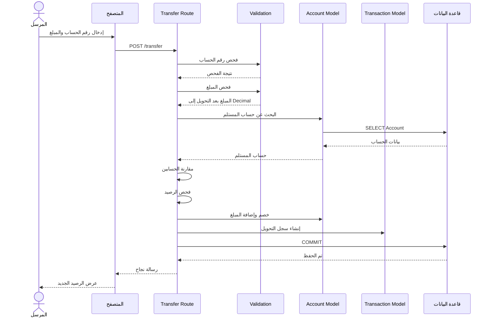

---

## 9. مخطط قاعدة البيانات

```mermaid
erDiagram

    USERS -- ACCOUNTS : owns

    ACCOUNTS ||--o{ TRANSACTIONS : sends

    ACCOUNTS ||--o{ TRANSACTIONS : receives

    USERS {
        integer id PK
        string username UK
        string email UK
        string password_hash
        string role
        boolean is_active
        datetime created_at
    }

    ACCOUNTS {
        integer id PK
        string account_number UK
        decimal balance
        integer user_id FK
    }

    TRANSACTIONS {
        integer id PK
        integer sender_account_id FK
        integer receiver_account_id FK
        decimal amount
        datetime created_at
    }

```

---

## 10. مخطط المصادقة والصلاحيات

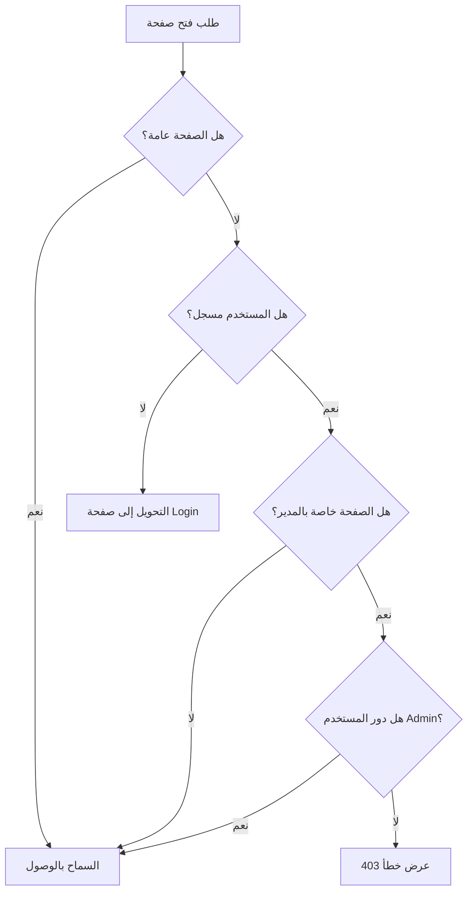

---

## 11. صلاحيات المستخدمين

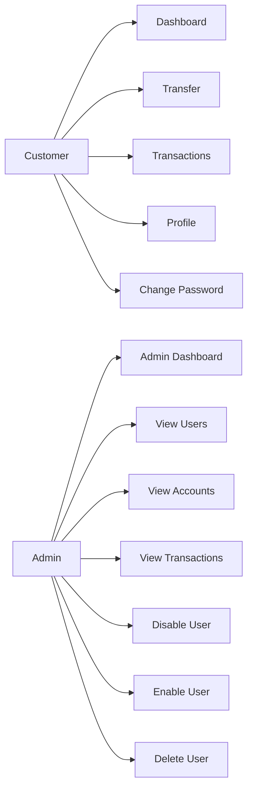

---

## 12. مخطط تشفير كلمة المرور

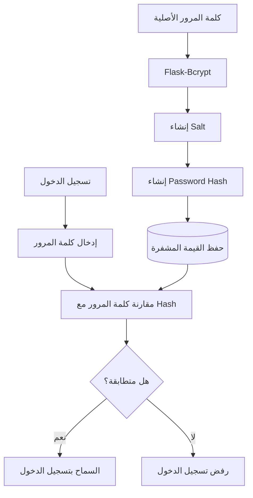

---

## 13. مخطط حماية النماذج باستخدام CSRF

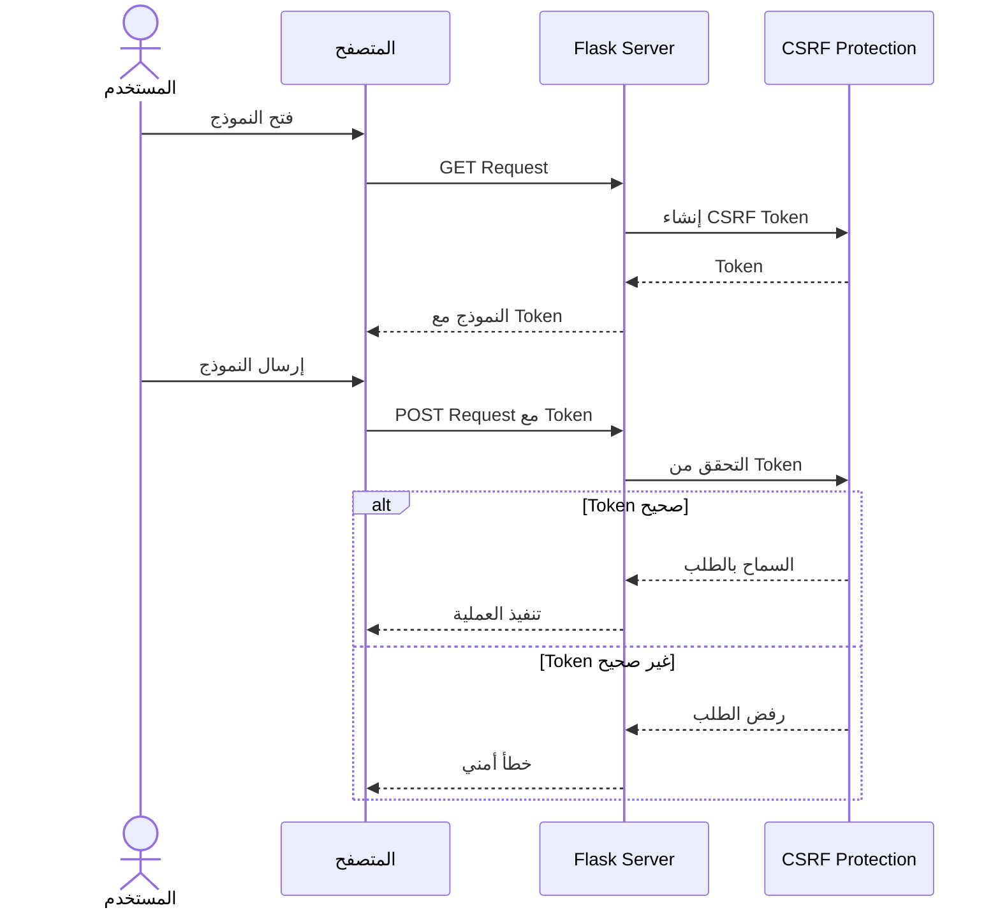

---

## 14. مخطط تحديد عدد المحاولات

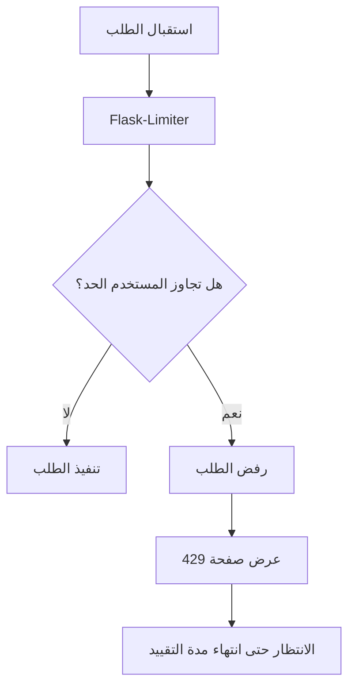

---

## 15. مخطط معالجة الأخطاء

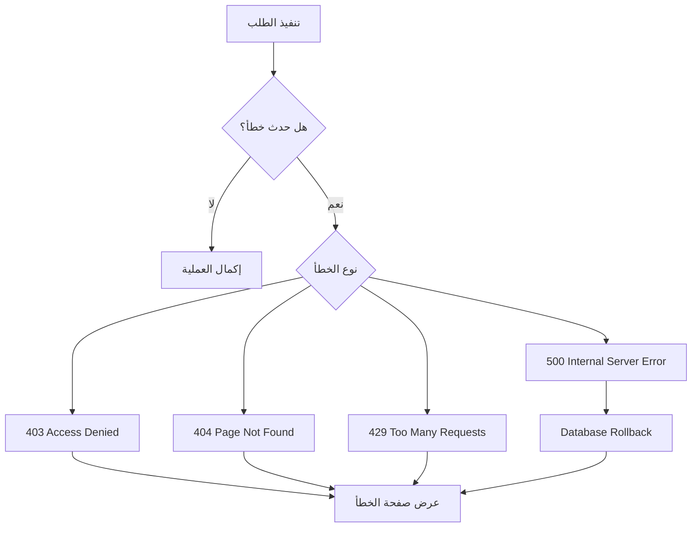

---

## 16. مخطط الاختبارات الآلية

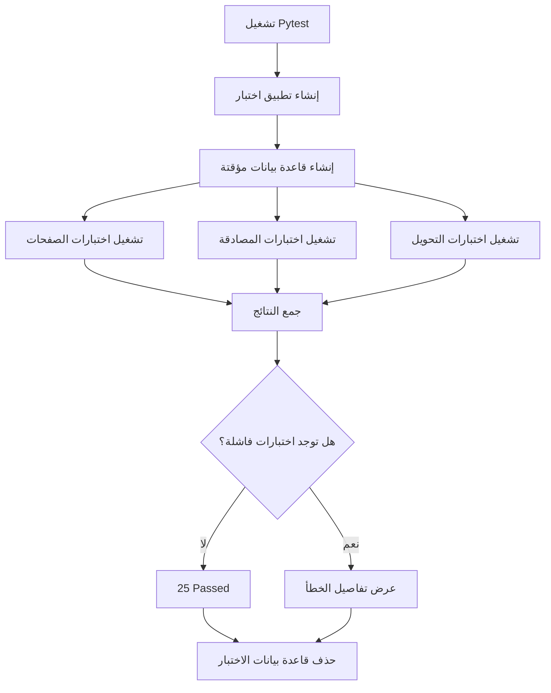

---

## 17. دورة حياة المستخدم

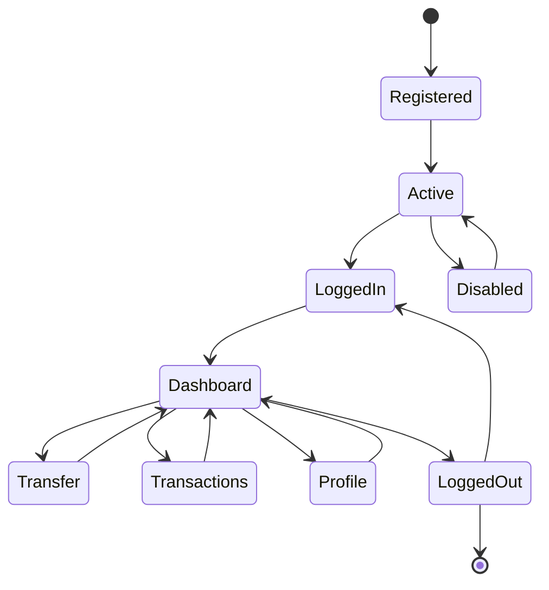

---

## 18. مخطط ملفات المشروع

```mermaid
flowchart TD
    ROOT[secure_Banking_System_pro]

    ROOT --> BACKEND[backend]
    ROOT --> TESTS[tests]
    ROOT --> DOCS[docs]
    ROOT --> DATABASE[database]
    ROOT --> DOCKER[docker]
    ROOT --> FRONTEND[frontend]
    ROOT --> GITHUB[.github]

    BACKEND --> APP[app]
    BACKEND --> INSTANCE[instance]
    BACKEND --> CONFIG[config.py]
    BACKEND --> REQ[requirements.txt]
    BACKEND --> RUN[run.py]

    APP --> MODELS[models]
    APP --> ROUTES[routes]
    APP --> SECURITY[security]
    APP --> TEMPLATES[templates]
    APP --> STATIC[static]
    APP --> EXT[extensions.py]

    SECURITY --> HEADERS[headers.py]
    SECURITY --> HASHING[hashing.py]
    SECURITY --> VALIDATION[validation.py]
    SECURITY --> CSRF_FILE[csrf.py]

    TESTS --> TEST_PAGES[test_pages.py]
    TESTS --> TEST_AUTH[test_auth.py]
    TESTS --> TEST_TRANSFER[test_transfer.py]
    TESTS --> CONFTEST[conftest.py]

    DOCS --> PROJECT_REPORT[project_report.md]
    DOCS --> DB_DESIGN[database_design.md]
    DOCS --> SECURITY_FEATURES[security_features.md]
    DOCS --> TESTING_REPORT[testing_report.md]
    DOCS --> USER_GUIDE[user_guide.md]
    DOCS --> SSDLC[ssdlc_report.md]
    DOCS --> THREAT[threat_model.md]
    DOCS --> DIAGRAMS[diagrams]
    DOCS --> SECURITY_REPORTS[security_reports]

    GITHUB --> WORKFLOWS[workflows]
    WORKFLOWS --> TESTS_YML[tests.yml]
```

---

## 19. ملخص المخططات الوظيفية

توضح هذه المخططات طريقة عمل النظام المصرفي الآمن من مرحلة استقبال طلب المستخدم حتى معالجة البيانات وحفظها في قاعدة البيانات.

كما توضح آلية التسجيل، تسجيل الدخول، تنفيذ التحويل، التحكم في الصلاحيات، تشفير كلمات المرور، حماية CSRF، معالجة الأخطاء، وتنفيذ الاختبارات الآلية.

تساعد هذه المخططات على فهم النظام بصورة أسرع، كما تسهل شرح المشروع أثناء العرض أو المناقشة.

---

## 20. مخطط المعمارية الأمنية

يوضح المخطط التالي أماكن تطبيق الضوابط الأمنية بين المستخدم والتطبيق وقاعدة البيانات:

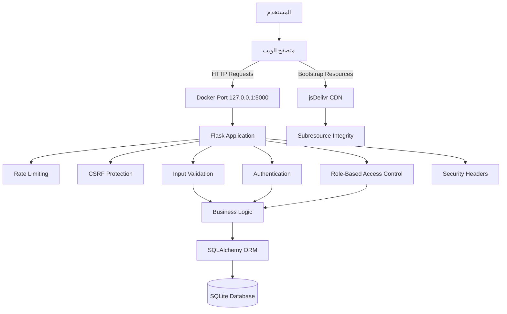

---

## 21. طبقات الحماية الأمنية

يستخدم المشروع مبدأ الدفاع متعدد الطبقات، بحيث لا يعتمد الأمان على إجراء واحد فقط:

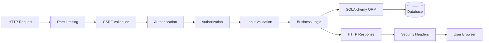

### الضوابط المطبقة

- تشفير كلمات المرور باستخدام Bcrypt.
- حماية الجلسات باستخدام Flask-Login.
- حماية النماذج باستخدام CSRF Token.
- تحديد عدد الطلبات باستخدام Flask-Limiter.
- التحقق من المدخلات داخل الخادم.
- التحكم في الوصول بناءً على دور المستخدم.
- استخدام SQLAlchemy ORM.
- إضافة Content Security Policy.
- إضافة X-Frame-Options وX-Content-Type-Options.
- إضافة Referrer-Policy وPermissions-Policy.
- حماية Cookies باستخدام HttpOnly وSameSite.
- التحقق من ملفات Bootstrap الخارجية باستخدام Subresource Integrity.
- استخدام Commit وRollback للمحافظة على اتساق التحويلات.

---

## 22. حدود الثقة

تمثل حدود الثقة النقاط التي تنتقل عندها البيانات بين مناطق ذات مستويات ثقة مختلفة:

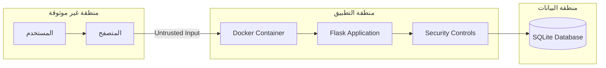

### الحدود الرئيسية

1. **المستخدم والمتصفح:** جميع البيانات القادمة من المستخدم تعد غير موثوقة.
2. **المتصفح وتطبيق Flask:** يجب التحقق من الطلب والمصادقة والصلاحيات وCSRF.
3. **التطبيق وقاعدة البيانات:** لا يتم الوصول إلى البيانات إلا من خلال SQLAlchemy.
4. **التطبيق والموارد الخارجية:** يتم التحقق من ملفات CDN باستخدام SRI.
5. **الجهاز المضيف وحاوية Docker:** التطبيق معزول داخل الحاوية ومتاح محليًا فقط.

---

## 23. مخطط الاختبارات الأمنية

```mermaid
flowchart TD
    SOURCE[Python Source Code] --> BANDIT[Bandit SAST]
    RUNNING_APP[Running Flask Application] --> ZAP[OWASP ZAP DAST]
    TEST_CODE[Automated Test Suite] --> PYTEST[Pytest]
    REPOSITORY[GitHub Repository] --> ACTIONS[GitHub Actions]

    BANDIT --> SECURITY_REPORTS[Security Reports]
    ZAP --> SECURITY_REPORTS
    PYTEST --> TEST_RESULTS[Test Results]
    ACTIONS --> TEST_RESULTS
```

### النتائج النهائية

| الاختبار | الأداة | النتيجة |
|---|---|---|
| الاختبارات البرمجية | Pytest | 25 اختبارًا ناجحًا |
| SAST | Bandit | لا توجد مشكلات أمنية مصنفة |
| DAST | OWASP ZAP | 0 High، 0 Medium، 0 Low |
| التكامل المستمر | GitHub Actions | ناجح |

تم تنفيذ فحص OWASP ZAP كفحص Baseline أولي غير مصادق عليه للصفحات العامة.

---

## 24. بنية التشغيل الحالية باستخدام Docker

```mermaid
flowchart TD
    LOCAL_USER[المستخدم المحلي] --> LOCAL_BROWSER[المتصفح]
    LOCAL_BROWSER -->|http://localhost:5000| HOST_PORT[127.0.0.1:5000]
    HOST_PORT --> CONTAINER_APP[Docker Container]
    CONTAINER_APP --> FLASK_SERVER[Flask Application]
    FLASK_SERVER --> SQLALCHEMY[SQLAlchemy]
    SQLALCHEMY --> LOCAL_DB[(SQLite Database)]
```

### خصائص التشغيل الحالي

- التطبيق يعمل داخل Docker.
- المنفذ مرتبط بالجهاز المحلي فقط.
- قاعدة البيانات محفوظة خارج طبقات الحاوية المؤقتة.
- المشروع مخصص للعرض الأكاديمي والتطوير المحلي.
- لم يتم نشر التطبيق على خادم إنتاج عام.

---

## 25. البنية المقترحة لبيئة الإنتاج

```mermaid
flowchart TD
    PROD_USER[المستخدم] --> HTTPS[HTTPS]
    HTTPS --> NGINX[Nginx Reverse Proxy]
    NGINX --> GUNICORN[Gunicorn WSGI Server]
    GUNICORN --> PROD_FLASK[Flask Application]

    PROD_FLASK --> POSTGRES[(PostgreSQL)]
    PROD_FLASK --> AUDIT[Audit Logging]
    PROD_FLASK --> MFA[MFA and Email Service]
    PROD_FLASK --> SECRETS[Secret Management]

    MONITORING[Security Monitoring] --> PROD_FLASK
    BACKUPS[Automated Backups] --> POSTGRES
```

### التحسينات المقترحة للإنتاج

- استخدام HTTPS.
- استخدام Nginx وGunicorn.
- الانتقال من SQLite إلى PostgreSQL.
- إضافة المصادقة الثنائية.
- إضافة سجل تدقيق أمني شامل.
- استخدام نظام آمن لإدارة الأسرار.
- إضافة مراقبة وتنبيهات أمنية.
- إنشاء نسخ احتياطية تلقائية.
- تنفيذ فحص ZAP مصادق عليه للصفحات الداخلية.

---

## 26. القيود الحالية

- المشروع تطبيق Flask موحد وليس Microservices.
- لا يوجد API Gateway.
- التشغيل الحالي محلي عبر HTTP.
- لا توجد مصادقة ثنائية.
- لا يوجد تحقق من البريد الإلكتروني.
- لا يوجد Audit Logging شامل.
- قاعدة البيانات الحالية SQLite.
- يتم استخدام Flask Development Server.
- فحص OWASP ZAP الحالي غير مصادق عليه.
- لا توجد مراقبة مركزية أو نسخ احتياطية تلقائية.
- المشروع نموذج أكاديمي وليس نظامًا مصرفيًا إنتاجيًا حقيقيًا.

---

## 27. الخاتمة

توضح المخططات البنية الوظيفية والأمنية لنظام Secure Banking System، بدءًا من استقبال طلب المستخدم، مرورًا بالمصادقة والتحقق من المدخلات وتنفيذ منطق التحويل، وصولًا إلى حفظ البيانات داخل قاعدة البيانات.

كما توضح المخططات تطبيق مبدأ الدفاع متعدد الطبقات، وحدود الثقة، وتشغيل المشروع داخل Docker، وربط الاختبارات البرمجية والأمنية بدورة حياة تطوير البرمجيات الآمنة.

تم الحفاظ على المخططات الوظيفية الأصلية وإضافة المعمارية الأمنية، والاختبارات الأمنية، وبنية التشغيل الحالية، والبنية المقترحة للإنتاج، والقيود الحالية، مما يجعل المستند أكثر اكتمالًا وملاءمة للعرض والمناقشة.